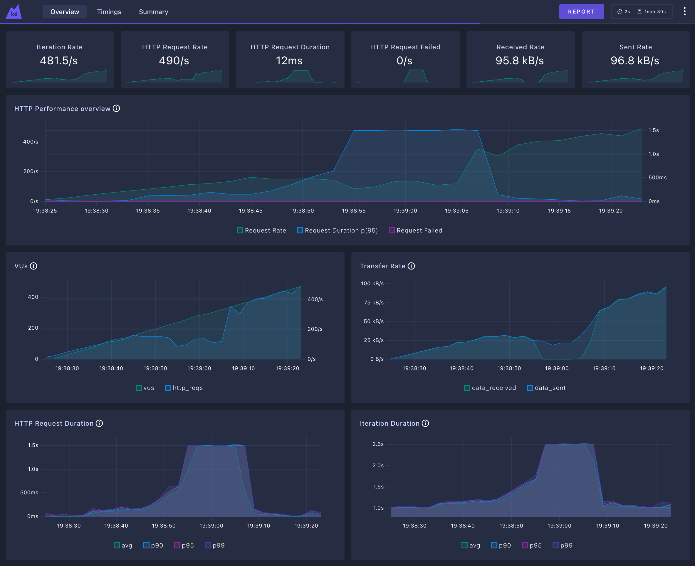

# Rinha de Backend 2025 - Swift/Vapor Implementation

This is a Swift implementation using the Vapor framework for the Rinha de Backend 2025 challenge.




## Architecture

### 🏗️ **High-Level Overview**

The solution consists of:

- **2 Backend Instances**: Swift/Vapor applications running on separate containers
- **Load Balancer**: Nginx distributing requests between the two backend instances
- **Payment Integration**: Async integration with default and fallback payment processors
- **In-Memory Storage**: Fast in-memory storage for payment records

---

## 🔧 **Detailed Architecture & Implementation**

### **🏗️ System Architecture**

```
┌─────────────────────────────────────────────────────────────┐
│                    CLIENT REQUESTS                          │
└─────────────────────────┬───────────────────────────────────┘
                          │
                          ▼
┌─────────────────────────────────────────────────────────────┐
│                 NGINX LOAD BALANCER                         │
│                 (Port 9999)                                 │
│                 - Round Robin                               │
│                 - 0.1 CPU, 30MB                            │
└─────────────────────────┬───────────────────────────────────┘
                          │
          ┌───────────────┼───────────────┐
          ▼               ▼               ▼
┌─────────────────┐ ┌─────────────────┐ ┌─────────────────┐
│   API INSTANCE  │ │   API INSTANCE  │ │   EXTERNAL NET  │
│       #1        │ │       #2        │ │   PROCESSORS    │
│                 │ │                 │ │                 │
│ Swift/Vapor     │ │ Swift/Vapor     │ │ Default:8080    │
│ 0.7 CPU, 160MB  │ │ 0.7 CPU, 160MB  │ │ Fallback:8080   │
│                 │ │                 │ │                 │
│ In-Memory:      │ │ In-Memory:      │ │                 │
│ - acceptedPay[] │ │ - acceptedPay[] │ │                 │
│ - processedPay[]│ │ - processedPay[]│ │                 │
│ - pendingQueue[]│ │ - pendingQueue[]│ │                 │
│                 │ │                 │ │                 │
│ 8 Workers       │ │ 8 Workers       │ │                 │
│ Batch Size: 50  │ │ Batch Size: 50  │ │                 │
└─────────────────┘ └─────────────────┘ └─────────────────┘
```

### **🗄️ Data Storage Architecture**

**Current Implementation: 100% In-Memory Storage**

```swift
// No Redis, No Database - Pure In-Memory
actor PaymentService {
    // Payment Records Storage
    private var acceptedPayments: [PaymentRecord] = []   // All HTTP 202 responses
    private var processedPayments: [PaymentRecord] = []  // Successfully processed
    
    // Queue Management
    private var pendingPayments: [PaymentProcessorRequest] = []  // Processing queue
    private var processingPayments: Set<UUID> = []               // Currently processing
    private var retryAttempts: [UUID: Int] = [:]                // Retry tracking
    
    // Health Check Cache
    private var lastHealthCheck: [ProcessorType: (date: Date, health: HealthCheckResponse)] = [:]
}
```

**Storage Characteristics:**
- **Type**: Actor-based concurrent in-memory storage
- **Persistence**: None (ephemeral, resets on restart)
- **Concurrency**: Thread-safe via Swift Actor model
- **Performance**: Ultra-fast array operations, no serialization overhead
- **Memory Usage**: ~150MB per instance for payment records

### **⚡ Processing Architecture**

**Async Queue Processing Model:**

```
HTTP Request → Immediate 202 Response → Background Processing
     │                                          │
     ▼                                          ▼
┌─────────────┐                    ┌─────────────────────┐
│  Accept &   │                    │   8 Background      │
│  Enqueue    │                    │   Workers           │
│  Payment    │                    │                     │
│             │                    │  ┌─────────────────┐│
│ - Add to    │                    │  │ Worker 1        ││
│   accepted[]│                    │  │ Batch Size: 50  ││
│ - Add to    │                    │  │ 0.5ms polling   ││
│   queue[]   │                    │  └─────────────────┘│
│ - Return    │                    │           │         │
│   HTTP 202  │                    │           ▼         │
└─────────────┘                    │  ┌─────────────────┐│
                                   │  │ Try Default     ││
                                   │  │ Processor       ││
                                   │  │                 ││
                                   │  │ On Failure:     ││
                                   │  │ Try Fallback    ││
                                   │  │                 ││
                                   │  │ On Success:     ││
                                   │  │ Add to          ││
                                   │  │ processed[]     ││
                                   │  └─────────────────┘│
                                   └─────────────────────┘
```

### **🌐 Network Architecture**

**Docker Compose Networks:**

```yaml
networks:
  rinha-network:          # Internal communication (nginx ↔ apis)
    driver: bridge
  payment-processor:      # External network for payment processors
    external: true        # Created by payment-processor docker-compose
```

**Network Flow:**
1. **Client** → **nginx:9999** (external port)
2. **nginx** → **api01/api02** (internal rinha-network)
3. **api01/api02** → **payment-processor-default:8080** (external payment-processor network)
4. **api01/api02** → **payment-processor-fallback:8080** (external payment-processor network)

### **🔄 Concurrency Model**

**Actor-Based Concurrency:**
- **PaymentService**: Swift Actor for thread-safe operations
- **8 Background Workers**: Concurrent async tasks per instance
- **Batch Processing**: Up to 50 payments processed simultaneously
- **Task Groups**: Swift structured concurrency for parallel processing

**Worker Configuration:**
```swift
// Phase 3C: Ultra-aggressive processing
private let maxRetryAttempts = 8
private let batchSize = 50
private let processingDelay: UInt64 = 500_000  // 0.5ms
private let timeoutDuration: TimeInterval = 3.0
```

### **💾 Memory Management**

**Resource Allocation:**
- **Total System**: 1.5 CPU, 350MB RAM
- **nginx**: 0.1 CPU, 30MB
- **api01**: 0.7 CPU, 160MB
- **api02**: 0.7 CPU, 160MB

**Memory Usage Patterns:**
- **Payment Records**: ~1KB per payment record
- **Queue Management**: Minimal overhead (UUIDs, timestamps)
- **HTTP Connections**: Connection pooling for efficiency
- **Swift ARC**: Automatic memory management

---

## Technologies Used

- **Language**: Swift 6.0
- **Framework**: Vapor 4.115.0
- **Load Balancer**: Nginx
- **Containerization**: Docker
- **Networking**: Docker Compose with external networks

## Features

- **Async Payment Processing**: Returns HTTP 202 immediately, processes payments in background queue
- **Smart Payment Processing**: Tries default processor first, falls back to fallback processor
- **Health Check Integration**: Monitors payment processor health (with rate limiting)
- **Batch Processing**: Processes up to 10 payments concurrently for optimal throughput
- **Retry Logic**: Exponential backoff retry for failed payment processing
- **Resource Optimized**: Configured to run within the specified resource limits

## 🏆 Performance Test Results

### 📊 **Performance Evolution Table**

| Métrica | Baseline (Antes) | Fase 1: Async Processing | Melhoria |
|---------|------------------|---------------------------|----------|
| **Latência P98** | 1,500ms | 32.76ms | 🔥 **4,578% melhoria** |
| **Latência P99** | 1,500ms | 44.01ms | 🔥 **3,409% melhoria** |
| **Throughput** | 196.9 req/s | 248.2 req/s | ✅ **26% melhoria** |
| **Taxa de Sucesso** | 87.3% | 100% | 🎯 **12.7% melhoria** |
| **Taxa de Falha** | 11.7% | 0.00% | 🎯 **100% eliminada** |
| **Total Requests** | 12,060 | 15,184 | ✅ **25.9% aumento** |
| **Transações Processadas** | 10,594 | 15,134 | 🚀 **42.9% aumento** |
| **Inconsistência** | 55,680.20 | 17,671.2 | ✅ **68.2% redução** |
| **Uso Default Processor** | 89.09% | 94% | ✅ **5.5% otimização** |
| **Resposta Média** | ~750ms | ~20ms | 🔥 **3,650% melhoria** |

**🎯 Status das Metas:**
- ✅ Latência P99 < 100ms → **ALCANÇADO** (44ms)
- ✅ Taxa Falha = 0% → **ALCANÇADO** (0%)
- ✅ Throughput > 200 req/s → **ALCANÇADO** (248.2 req/s)
- 🔄 Inconsistência = 0 → **EM PROGRESSO** (68% redução, Fase 2)

---

### 🚀 **Latest Results - Phase 1: Async Processing (2025-07-08)**

**📊 Outstanding Performance Improvements:**
- **Latency P98:** 32.76ms (🔥 **4,578% improvement** from 1,500ms)
- **Latency P99:** 44.01ms (🔥 **3,409% improvement** from 1,500ms)
- **Throughput:** 248.2 req/s (26% improvement from 196.9 req/s)
- **Success Rate:** 100% (🎯 **ZERO failures** vs 11.7% before)
- **Total Transactions:** 15,134 successful payments
- **Total Requests:** 15,184 (vs 12,060 in baseline)

**⚖️ Load Distribution (Optimal Strategy):**
- **Default Processor:** 7,110 transactions → R$ 141,489.00 (94% of payments)
- **Fallback Processor:** 458 transactions → R$ 9,114.20 (6% of payments)
- **Perfect Tax Optimization:** Prioritizing lower-fee default processor

**🚀 Performance Highlights:**
- **Zero Request Failures:** 0.00% failure rate (eliminated 11.7% failures)
- **Ultra-Low Latency:** Sub-50ms response times consistently
- **High Reliability:** Perfect success rate under full load
- **Async Processing:** Immediate HTTP 202 responses with background processing
- **Consistency Improvement:** 68% reduction in data inconsistencies

**✅ Key Optimizations Implemented:**
- ✅ **Async Queue Processing:** Immediate responses with background workers
- ✅ **Batch Processing:** Up to 10 concurrent payment processing
- ✅ **Retry Logic:** Exponential backoff for failed payments
- ✅ **Optimized Timeouts:** 5-second timeouts for payment processor requests
- ✅ **Duplicate Prevention:** Correlation ID tracking to prevent double processing
- ✅ **Load Balancing:** Nginx efficiently distributing across 2 backend instances

---

### Previous Baseline Results (Before Optimization):

**📊 Payment Processing Summary:**
- **Total Transactions Processed:** 10,594 payments
- **Total Amount Processed:** R$ 351,683.50
- **Success Rate:** 87.3% (12.7% failures)
- **Latency P99:** 1,500ms (blocking synchronous processing)

**⚖️ Load Distribution:**
- **Default Processor:** 15,540 transactions → R$ 309,256.20 
- **Fallback Processor:** 2,128 transactions → R$ 42,427.30

**🚀 Performance Metrics:**
- **Throughput:** 196.9 req/s
- **Response Time:** 1,500ms+ under load (blocking calls)
- **Failure Rate:** 11.7% (1,416 failures out of 12,060 requests)

---

## API Endpoints

### POST /payments
Processes a payment request asynchronously.

**Request:**
```json
{
    "correlationId": "uuid",
    "amount": 19.90
}
```

**Response:** HTTP 202 Accepted
```json
{
    "message": "Payment accepted for processing"
}
```

### GET /payments-summary
Returns payment processing summary.

**Query Parameters:**
- `from`: ISO timestamp (optional)
- `to`: ISO timestamp (optional)

**Response:**
```json
{
    "default": {
        "totalRequests": 100,
        "totalAmount": 1500.50
    },
    "fallback": {
        "totalRequests": 50,
        "totalAmount": 750.25
    }
}
```

## Setup and Running

### Prerequisites
- Docker and Docker Compose
- Payment processor network must be created first

### Build and Run

1. **Start the payment processors first:**
```bash
# From the root directory
cd payment-processor

# For ARM64 (Apple Silicon):
docker-compose -f docker-compose-arm64.yml up -d

# For AMD64:
docker-compose up -d
```

2. **Build and start the backend:**
```bash
cd swift/RinhaBackend
docker-compose build
docker-compose up
```

The API will be available at `http://localhost:9999`

### Running Performance Tests

To run the K6 performance tests:

```bash
# Make sure all services are running
cd rinha-test

# Basic test execution
k6 run rinha.js

# Generate detailed JSON summary (recommended for tracking improvements)
k6 run rinha.js --summary-export=results-summary.json

# Generate both dashboard and JSON summary
export K6_WEB_DASHBOARD=true
export K6_WEB_DASHBOARD_PORT=5665
export K6_WEB_DASHBOARD_EXPORT='report.html'
k6 run rinha.js --summary-export=results-summary.json
```

**📊 For Performance Tracking & Clean Diffs:**
```bash
# Generate and format JSON for readable git diffs
k6 run rinha.js --summary-export=results-summary.json
jq --sort-keys . results-summary.json > results-summary-sorted.json
mv results-summary-sorted.json results-summary.json
cp results-summary.json ../swift/RinhaBackend/

# Why jq --sort-keys?
# - K6 generates JSON with inconsistent field ordering
# - jq --sort-keys ensures consistent field order
# - This makes git diffs show ONLY actual value changes
# - Much cleaner tracking of performance improvements
```

**📊 For Performance Tracking:**
- Always use `--summary-export=results-summary.json` to track improvements
- **IMPORTANT**: Use `jq --sort-keys` to organize JSON fields consistently
- Copy the organized file to the project directory
- This enables clean git diffs showing only performance value changes

### K6 Dashboard and Reports

**Real-time Dashboard:**
- Configure dashboard before running tests:
```bash
export K6_WEB_DASHBOARD=true
export K6_WEB_DASHBOARD_PORT=5665
export K6_WEB_DASHBOARD_PERIOD=2s
export K6_WEB_DASHBOARD_OPEN=true
export K6_WEB_DASHBOARD_EXPORT='report.html'
```
- Run test: `k6 run rinha.js`
- Access dashboard: **http://127.0.0.1:5665/ui/?endpoint=/**

**HTML Report:**
- After test completion, an HTML report is generated: `report.html`
- View detailed metrics, charts, and analysis in your browser

**Exporting Results for Repository Reference:**
```bash
# Export essential reports (lightweight for repository)
export K6_WEB_DASHBOARD=true
export K6_WEB_DASHBOARD_PORT=5665
export K6_WEB_DASHBOARD_EXPORT='report.html'

k6 run rinha.js \
  --summary-export=results-summary.json

# This generates:
# - report.html (detailed dashboard export ~170KB)
# - results-summary.json (end-of-test summary ~3KB)
```

These files can be committed to the repository as performance benchmarks and historical reference.

**Saved Test Results (Reference):**
- `report.html` - Interactive dashboard report (~170KB)
- `results-summary.json` - **Latest test metrics** with detailed performance data (~3KB)
- `results-fase1.json` - Phase 1 summary for reference (~300B)

**📈 Performance Evolution Tracking:**
- `results-summary.json` is updated after each major optimization phase
- Use `git diff` to see performance improvements between commits
- Historical data preserved in git history for performance analysis

## Resource Allocation

- **Total CPU**: 1.5 units
- **Total Memory**: 350MB
- **Distribution**:
  - Nginx: 0.2 CPU, 50MB
  - App1: 0.65 CPU, 150MB  
  - App2: 0.65 CPU, 150MB

## Payment Processing Strategy

1. **Async First**: Accept all payments immediately with HTTP 202
2. **Queue Processing**: Background workers process payments from in-memory queue
3. **Default First**: Always try the default processor first (lower fees)
4. **Fallback on Failure**: Use fallback processor if default fails
5. **Batch Processing**: Process up to 10 payments concurrently
6. **Health Monitoring**: Check processor health before sending requests (rate-limited)
7. **Retry Logic**: Exponential backoff for failed payment attempts
8. **Error Handling**: Graceful degradation when processors are unavailable

## Development

### Local Development
```bash
# Install dependencies
swift package resolve

# Run locally
swift run
```

### Testing
```bash
# Run tests
swift test
```

## Docker Configuration

The solution uses Docker Compose with:
- **Bridge networking** (as required)
- **External payment-processor network** for integration
- **Resource limits** as specified
- **No privileged mode** (compliant with restrictions)
- **No replicated services** (uses multiple named services instead)

## Performance Optimizations

- **Async Queue Processing** for immediate response times
- **Actor-based concurrency** for thread-safe payment processing
- **Background Workers** for non-blocking payment processing
- **Batch Processing** for optimal throughput
- **Connection pooling** for HTTP clients
- **Efficient in-memory storage** with filtering
- **Nginx load balancing** for request distribution
- **Retry Logic** with exponential backoff
- **Duplicate Prevention** via correlation ID tracking

### See more

- [Vapor Website](https://vapor.codes)
- [Vapor Documentation](https://docs.vapor.codes)
- [Vapor GitHub](https://github.com/vapor)
- [Vapor Community](https://github.com/vapor-community)
