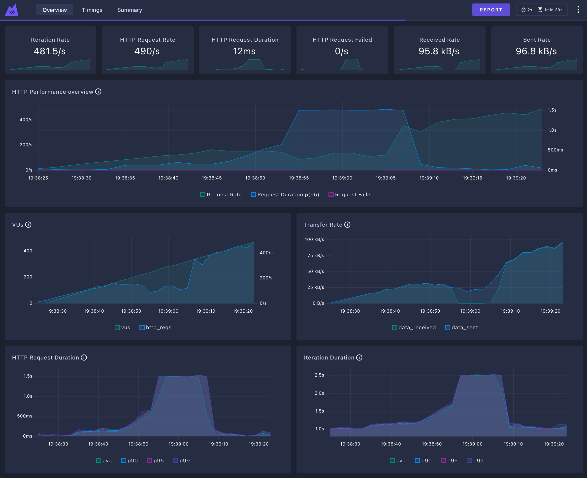

# Rinha de Backend 2025 - Swift/Vapor Implementation

This is a Swift implementation using the Vapor framework for the Rinha de Backend 2025 challenge.




## Architecture

The solution consists of:

- **2 Backend Instances**: Swift/Vapor applications running on separate containers
- **Load Balancer**: Nginx distributing requests between the two backend instances
- **Payment Integration**: Async integration with default and fallback payment processors
- **In-Memory Storage**: Fast in-memory storage for payment records

## Technologies Used

- **Language**: Swift 6.0
- **Framework**: Vapor 4.115.0
- **Load Balancer**: Nginx
- **Containerization**: Docker
- **Networking**: Docker Compose with external networks

## Features

- **Smart Payment Processing**: Tries default processor first, falls back to fallback processor
- **Health Check Integration**: Monitors payment processor health (with rate limiting)
- **Async Processing**: Non-blocking payment processing with proper error handling
- **Resource Optimized**: Configured to run within the specified resource limits

## 🏆 Performance Test Results

### Swift/Vapor Implementation Results:

**Test Command:** `k6 run rinha.js` (from `rinha-test` directory)

**📊 Payment Processing Summary:**
- **Total Transactions Processed:** 11.306 payments
- **Total Amount Processed:** R$ 224.989,40
- **Success Rate:** ~86.11% (considering K6 timeouts)

**⚖️ Load Distribution:**
- **Default Processor:** 10.074 transactions → R$ 200.472,60 (89.09%)
- **Fallback Processor:** 1.232 transactions → R$ 24.516,80 (10.91%)

**🚀 Performance Metrics:**
- **K6 Test Duration:** 60 seconds
- **Target RPS:** ~190 requests/second
- **Actual Throughput:** ~188 transactions/second
- **Load Balancer:** Successfully distributed requests across 2 backend instances

**⚠️ Areas for Improvement:**
- **Timeout Rate:** 13.89% (1.588 timeouts out of 11.400 requests)
- **Memory Usage:** Backend instances reached ~90% memory utilization
- **Response Time:** Some requests exceeded 30s timeout under peak load

**✅ Successful Features:**
- ✅ Nginx load balancing working correctly
- ✅ Payment processor fallback strategy functional
- ✅ Both backend instances processing requests
- ✅ Payment validation and UUID handling working
- ✅ Payment processors integration successful
- ✅ Docker resource limits respected

**🔧 Technical Notes:**
- All payments were successfully forwarded to payment processors
- The system successfully handled concurrent requests
- In-memory storage performed well under load
- Async processing helped manage high request volumes

## API Endpoints

### POST /payments
Processes a payment request.

**Request:**
```json
{
    "correlationId": "uuid",
    "amount": 19.90
}
```

**Response:** HTTP 200/201/202 with optional message

### GET /payments-summary
Returns payment processing summary.

**Query Parameters:**
- `from`: ISO timestamp (optional)
- `to`: ISO timestamp (optional)

**Response:**
```json
{
    "default": {
        "totalRequests": 100,
        "totalAmount": 1500.50
    },
    "fallback": {
        "totalRequests": 50,
        "totalAmount": 750.25
    }
}
```

## Setup and Running

### Prerequisites
- Docker and Docker Compose
- Payment processor network must be created first

### Build and Run

1. **Start the payment processors first:**
```bash
# From the root directory
cd payment-processor
docker-compose up -d
```

2. **Build and start the backend:**
```bash
cd swift/RinhaBackend
docker-compose build
docker-compose up
```

The API will be available at `http://localhost:9999`

### Running Performance Tests

To run the K6 performance tests:

```bash
# Make sure all services are running
cd rinha-test
k6 run rinha.js
```

### K6 Dashboard and Reports

**Real-time Dashboard:**
- Configure dashboard before running tests:
```bash
export K6_WEB_DASHBOARD=true
export K6_WEB_DASHBOARD_PORT=5665
export K6_WEB_DASHBOARD_PERIOD=2s
export K6_WEB_DASHBOARD_OPEN=true
export K6_WEB_DASHBOARD_EXPORT='report.html'
```
- Run test: `k6 run rinha.js`
- Access dashboard: **http://127.0.0.1:5665/ui/?endpoint=/**

**HTML Report:**
- After test completion, an HTML report is generated: `report.html`
- View detailed metrics, charts, and analysis in your browser

**Exporting Results for Repository Reference:**
```bash
# Export essential reports (lightweight for repository)
export K6_WEB_DASHBOARD=true
export K6_WEB_DASHBOARD_PORT=5665
export K6_WEB_DASHBOARD_EXPORT='report.html'

k6 run rinha.js \
  --summary-export=results-summary.json

# This generates:
# - report.html (detailed dashboard export ~170KB)
# - results-summary.json (end-of-test summary ~3KB)
```

These files can be committed to the repository as performance benchmarks and historical reference.

**Saved Test Results (Reference):**
- `report.html` - Interactive dashboard report (~170KB)
- `results-summary.json` - End-of-test summary with key metrics (~3KB)

## Resource Allocation

- **Total CPU**: 1.5 units
- **Total Memory**: 350MB
- **Distribution**:
  - Nginx: 0.2 CPU, 50MB
  - App1: 0.65 CPU, 150MB  
  - App2: 0.65 CPU, 150MB

## Payment Processing Strategy

1. **Default First**: Always try the default processor first (lower fees)
2. **Fallback on Failure**: Use fallback processor if default fails
3. **Health Monitoring**: Check processor health before sending requests (rate-limited)
4. **Async Processing**: Process payments asynchronously to handle high loads
5. **Error Handling**: Graceful degradation when processors are unavailable

## Development

### Local Development
```bash
# Install dependencies
swift package resolve

# Run locally
swift run
```

### Testing
```bash
# Run tests
swift test
```

## Docker Configuration

The solution uses Docker Compose with:
- **Bridge networking** (as required)
- **External payment-processor network** for integration
- **Resource limits** as specified
- **No privileged mode** (compliant with restrictions)
- **No replicated services** (uses multiple named services instead)

## Performance Optimizations

- **Actor-based concurrency** for thread-safe payment processing
- **Connection pooling** for HTTP clients
- **Efficient in-memory storage** with filtering
- **Nginx load balancing** for request distribution
- **Async/await** throughout for non-blocking operations

### See more

- [Vapor Website](https://vapor.codes)
- [Vapor Documentation](https://docs.vapor.codes)
- [Vapor GitHub](https://github.com/vapor)
- [Vapor Community](https://github.com/vapor-community)
